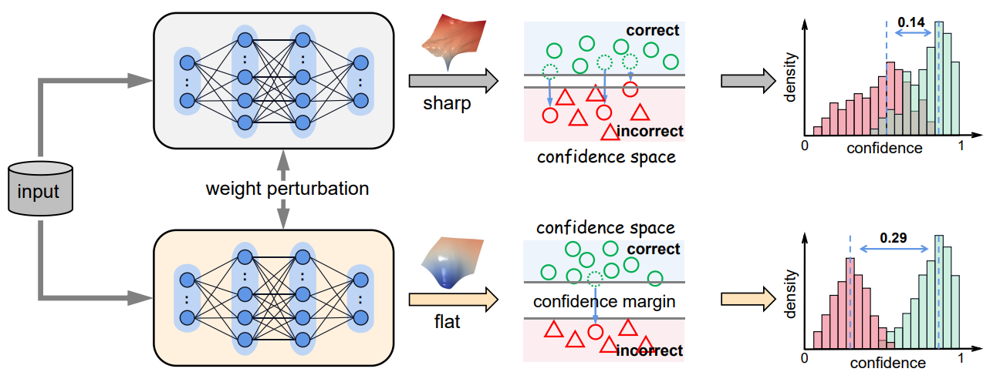

## FMFP - Official PyTorch Implementation

### [ECCV2022] Rethinking Confidence Calibration for Failure Prediction
Fei Zhu, Zhen Cheng, Xu-Yao Zhang, Cheng-Lin Liu 

### Reference
Our implementation references the codes in the following repositories:
* <https://github.com/daintlab/confidence-aware-learning>
* <https://github.com/davda54/sam>
* <https://github.com/timgaripov/swa>

### Contact
Fei Zhu (zhufei2018@ia.ac.cn)
